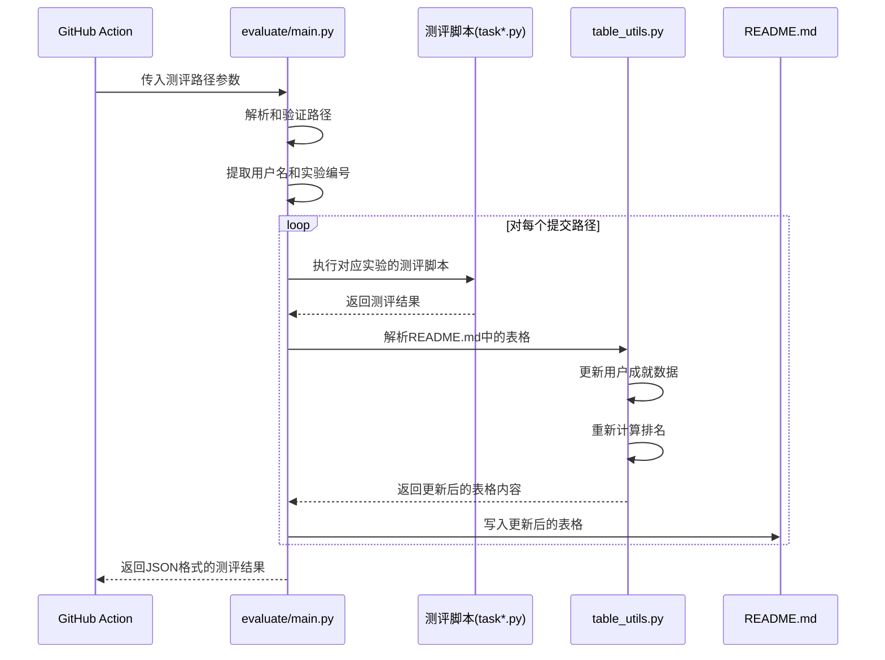

# Python Lab 测评程序说明

本文档介绍了 Python Lab 测评系统的使用方法、工作流程和输出格式。测评系统用于自动评估学习者提交的 Python 实验代码，并更新成绩表格。

## 测评程序工作流程



## 测评程序使用方式

测评程序通过命令行参数接收测评路径，格式如下：

```bash
python -m evaluate.main --path [username]/lab[number] [username]/lab[number] ...
```

### 参数说明

- `--path`: 必需参数，指定一个或多个测评路径。每个路径格式为 `[username]/lab[number]`，其中 `username` 是学习者的 GitHub 用户名，`number` 是实验编号。

### 示例

```bash
python -m evaluate.main --path user1/lab1 user2/lab2
```

## 测评程序输出格式

测评程序将结果以 JSON 格式输出到标准输出，同时将详细的日志信息输出到标准错误。

### JSON 输出格式

正常情况下，输出格式如下：

```json
[
  {
    "lab_num": 1,
    "username": "user1",
    "tasks": {
      "task1.py": {
        "task_file": "task1.py",
        "returncode": 0,
        "stdout": "测试通过",
        "stderr": "",
        "error": null
      },
      "task2.py": {
        "task_file": "task2.py",
        "returncode": 1,
        "stdout": "",
        "stderr": "测试失败：期望输出 10，实际输出 5",
        "error": null
      }
    },
    "passed": false,
    "error": null,
    "table_update_error": null
  }
]
```

当发生顶层异常时，输出格式如下：

```json
{
  "error": "顶层异常: 错误信息"
}
```

### 输出字段说明

- `lab_num`: 实验编号
- `username`: 学习者的 GitHub 用户名
- `tasks`: 包含所有任务测评结果的字典
  - 每个任务的键是任务文件名（如 `task1.py`）
  - 每个任务的值包含以下字段：
    - `task_file`: 任务文件名
    - `returncode`: 测评脚本的返回码（0 表示通过，非 0 表示失败）
    - `stdout`: 测评脚本的标准输出
    - `stderr`: 测评脚本的标准错误输出
    - `error`: 如果测评过程中发生异常，则包含异常信息，否则为 null
- `passed`: 整个实验是否通过（所有任务都通过才为 `true`）
- `error`: 如果整个实验测评过程中发生错误，则包含错误信息，否则为 null
- `table_update_error`: 如果更新 README.md 时发生错误，则包含错误信息，否则为 null

## 表格更新机制

测评程序会自动更新 README.md 中的成绩表格：

1. 计算每个实验的通过率（通过的任务数 / 总任务数）
2. 更新用户对应实验的成绩，格式为 `YYYY-MM-DD : XX.X%`
3. 如果全部通过，则显示为 `YYYY-MM-DD : √`
4. 重新计算用户完成的任务总数
5. 根据完成任务总数对用户进行排名

### 表格示例

| 用户排名 | 用户名 | lab1 | lab2 | 完成任务总数 |
| --- | --- | --- | --- | --- |
| 1 | user1 | 2024-01-22 : √ | 2024-01-23 : 50.0% | 2 |
| 2 | user2 | 2024-01-22 : 75.0% |  | 1 |

## 错误处理

测评程序包含多层错误处理机制：

1. 路径验证：确保测评路径格式正确
2. 任务执行超时处理：防止无限循环的代码
3. 异常捕获：捕获并记录测评过程中的各种异常
4. 详细日志：将详细的错误信息输出到标准错误流

## 开发者说明

测评系统由以下几个主要组件组成：

1. `main.py`: 主测评脚本，负责解析参数、执行测评和更新表格
2. `table_utils.py`: 表格处理工具，负责解析和格式化 Markdown 表格
3. `types.py`: 定义了测评结果的数据结构

测评脚本的执行环境与学习者提交的代码环境相同，可以直接访问学习者提交的文件。
